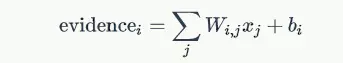

# tensorflow

**参考链接**

[中文文本分类器](https://github.com/fendouai/Chinese-Text-Classification)

[文本分类模型](https://zhuanlan.zhihu.com/p/30736422)

[tensorflow中文社区](http://www.tensorfly.cn/tfdoc/tutorials/overview.html)

**基本概念**

> TF的系统架构, 包括前端和后端. 前端提供编程模型, 负责构造计算图, 提供Python/C++/Java/Go等语言支持; 后端提供运行时环境, 负责执行计算图, 采用C++实现.

> TF采用符号式编程模式, 将计算过程抽象为计算图, 所有输入节点、运算节点和输出节点均符号化处理. 包含编译的步骤, 实际的计算发生在编译后.

- 使用图(graph)表示计算流程, 图中节点称为操作(operation)
- 在回话(session)中执行图
- 使用张量(tensor)表示数据
- 使用变量(variable)维护状态
- 使用feed和fetch为任意操作赋值或从中取值

> TF使用graph表示计算流程。图中的节点称为操作（Operation，以下简称OP）。每个OP接受0到多个Tensor，执行计算，输出0到多个Tensor。图是对计算流程的描述，需要在Session中运行。Session将计算图的OP分配到CPU或GPU等计算单元，并提供相关的计算方法，并且会返回OP的结果。

> TF使用Tensor表示所有数据，相当于Numpy中的ndarray，0维的数值、一维的矢量、二维的矩阵到n维数组都是Tensor。相对于Numpy，TensorFlow提供了创建张量函数的方法，以及导数的自动计算。

> 在训练模型时，Variable被用来存储和更新参数。Variable包含张量储存在内存的缓冲区中，必须显式地进行初始化，在训练后可以写入磁盘。

**mnist数据集**

55000行训练数据集`mnist.train`, 10000行测试数据集`mnist.test`, 5000行验证集`mnist.validation`.

每个mnist数据单元有两部分组成: 一张包含手写数字的图片和一个对应的标签, 图片设为`xs`, 标签设为`ys`. `mnist.train.images`和`mnist.train.labels`.

每张图片`28 X 28`像素, 可用数组来表示. 把数组展开成一个向量, 长度是`28 x 28 = 784`. (可参考`numpy`中的`ravel()`或`flatten（）`方法, 前者只提供`view`, 后者则分配内存存储)

所以`mnist.train.images`是一个形状为`[55000, 784]`的张量, 第一个维度数字用来索引图片, 第二个维度数字索引每张图片中的像素点. 在此张量里的每个元素, 表示某张图片里某个像素的强度值, 介于0和1之间.

`mnist.train.lables`是介于0到9的数字, 用来描述图片里的数字.  标签数据`one-hot vectors`, 即除了某一位的数字是1以外其余维度数字都是0. 因此`mnist.train.lables`是一个`[55000, 10]`的数字矩阵.

**Softmax回归**

> Softmax回归是二分类器logistic回归的推广，是一种最简单的多分类器。Softmax回归分为两步，首先通过加权求和得到一张给定图片属于特定数字类的证据（evidence），如果这个像素具有很强的证据说明这张图片不属于该类，那么相应的权值为负数，相反如果这个像素拥有有利的证据支持这张图片属于这个类，那么权值是正数。

对于给定的输入图片x它代表的是数字i的证据可表示为



给定一张图, 它对于每个数字的吻合度可以被softmax函数转换为一个概率值, 公式为：`y = softmax(Wx + b)`

**实现回归模型**

> TF程序可分为图的构建和图的执行两部分, 而图的构建又细分为输入图、推断图、训练图和评估图四部分.

- 输入图

> x = tf.placeholder('float', [None, 784])
> 
> y_ = tf.placeholder('float', [None, 10])

- 推断图

> W = tf.Variable(tf.zeros([784, 10]))
> 
> b = tf.Variable(tf.zeros([10]))
> 
> y = tf.nn.softmax(tf.matmul(x, W) + b)

- 训练图

机器学习中, 通常定义指标来表示一个模型是坏的, 这个指标称为cost或loss, 然后尽量最小化这个指标. 常见的cost/loss函数是交叉熵(cross-entropy).

`cross_entropy = -tf.reduce_sum(y_ * tf.log(y))`

梯度下降算法最小化交叉熵

`train_step = tf.train.GradientDescentOptimizer(0.5).minimize(cross_entropy)`

创建一个Session来运行模型

`sess = tf.InteractiveSession()`

初始化所有变量

`tf.global_variables_initializer().run()`

训练模型, 每次循环随机抓取训练数据中的100个批处理数据点

```
for _ in range(1000):
	batch_xs, batch_ys = mnist.train.next_batch(100)
	sess.run(train_step, feed_dict={x: batch_xs, y_: batch_ys})
```
- 
评估图

`correct_prediction = tf.equal(tf.argmax(y,1), tf.argmax(y_,1))` # 预测标签值和正确标签值是否相等

`accuracy = tf.reduce_mean(tf.cast(correct_prediction, tf.float32))` # 转换为平均值

`sess.run(accuracy, feed_dict={x: mnist.test.images, y_: mnist.test.labels})` # 执行计算图, 得到模型在测试数据集上的正确率

**使用tensorflow识别图片中的物体**

`python3 classify_image.py --model_dir ./model --image_file ./model/cropped_panda.jpg`

`python3 classify_image.py --model_dir ./model --image_file ./model/test_keyboard.jpg`

`python3 classify_image.py --model_dir ./model --image_file ./model/test_mouse.jpg`

**RNNs**

> RNNs目的是处理序列数据, 引入了定向循环，能处理输入之间前后关联的问题。在NLP中应用广泛，比如词向量word2vec、语句合法性检查、词性标注，机器翻译、语音识别. LSTMs 长短时记忆模型
